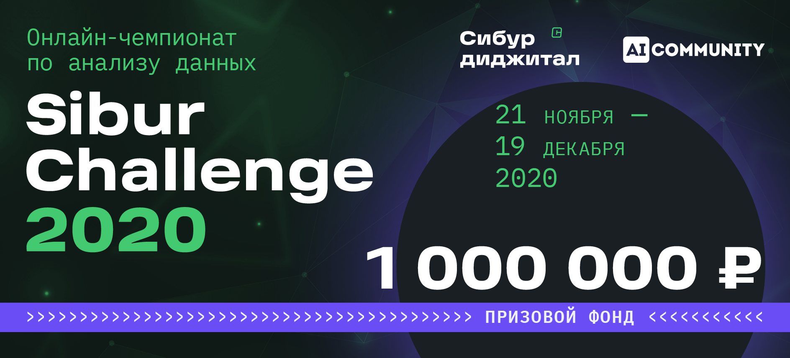
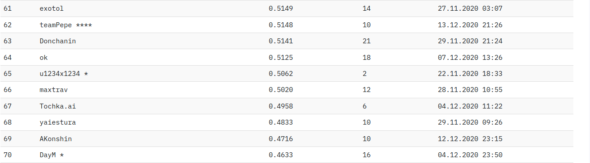

# Sibur Challenge 2020

## Сопоставление названий (Strings Matching)

Competition description and rules: [Competition](https://sibur.ai-community.com/competitions/4/tasks/12)

## 1. Results

Managed to get a 68th place / of 195 **(top 35%)** with pre-trained fine-tuned on train dataset XLM-ROBERTA model submission on first ever data science competition.

Competition leaderboard and rating: [Rating](https://sibur.ai-community.com/competitions/4/tasks/12/rating)

## 2. Task description (en)

Second challenge of the competition - "Company name matching".

### 2.1 Intro:

**SIBUR** is a Russian petrochemicals company founded in 1995 and headquartered in Moscow. 

SIBUR operates production sites located all over Russia, has over 1,400 major customers engaged in the energy, automotive, construction, fast-moving consumer goods, chemical and other industries in approximately 70 countries worldwide and employs around 26,000 personnel.

Sibur works with a huge number of new companies, and in order to optimize the workflow, it would be useful for them to understand that they are working with a previously familiar holding. For example, Sibur Neftekhim and SIBUR IT (**but SIBIR International and SIBUR IT are different companies**) are from the same holding, and when working with one of these companies it would be useful to use the information accumulated earlier on the SIBUR holding.

### 2.2 Task:

Given two company name, whether the companies belong to the same holding or not (are they affiliated) must be determined - target value: <code>is_duplicate = {0, 1}</code>.

Most of the dataset company names are in English, but it also may contain: Russian, Chinese, Arabic, etc.

The dataset markup was obtained partly by hand, partly - algorithmically. In addition, the markup may contain errors.

**Evaluation metric:** F1-score

This is what a sample dataset looks like:

| name_1        | name_2        | is_duplicate  |
|:-------------:|:-------------:|:-----:|
| Brenntag Australia (Pty) Ltd. | Brenntag Group | 1 |
| Apcotex Industries Ltd. | Technocraft Industries (India) Ltd. | 0 |
| Pirelli Neumaticos S.A.I.C. | Pirelli Tyre Co., Ltd. | 1 |
| Tress A/S | Longyou Industries Park Zhejiang | 0 |
|TOTAL CESKA REPUBLIKA s.r.o.| 	ТОТАЛ ФРАНЦИЯ | 1 |

## 3. Task description (ru)

При поиске новых клиентов СИБУРу приходится обрабатывать информацию о миллионах новых компаний из различных источников. Названия компаний при этом могут иметь разное написание, содержать сокращения или ошибки, быть аффилированными с компаниями, уже известными СИБУРу.

Для более эффективной обработки информации о потенциальных клиентах, СИБУРу необходимо знать, связаны ли два названия (т.е. принадлежат одной компании или аффилированным компаниям).

В этом случае СИБУР сможет использовать уже известную информацию о самой компании или об аффилированных компаниях, не дублировать обращения в компанию или не тратить время на нерелевантные компании или дочерние компании конкурентов.

Тренировочная выборка содержит пары названий из разных источников (в том числе, пользовательских) и разметку.

Разметка получена частично вручную, частично - алгоритмически. Кроме того, разметка может содержать ошибки. Вам предстоит построить бинарную модель, предсказывающую, являются ли два названия связанными. 

Метрика, используемая в данной задаче - F1 score.

В этой задаче можно и даже нужно пользоваться открытыми источниками данных для обогащения датасета или поиска дополнительной важной для определения аффилированных компаний информации.

### 3.1 Дополнительная информация

- Аффилированными компаниями считаются компании, принадлежащие одному холдингу или группе компаний. Например, все компании из списка: Сибур Нефтехим, ООО Сибур, Sibur Digital, СИБУР ИТ, Sibur international GMBH являются вариациями названий аффилированных компаний, а компания “Сибирь International GMBH” не является.
- Названия компаний могут писаться на разных языках: тренировочная и тестовая выборки содержат названия компаний на русском, английском и китайском языках.
- В названиях могут присутствовать сокращения, опечатки и дополнительная информация о компании, например, названия стран и провинций.
- Публичная (50%) и приватная (50%) части тестового множества не пересекаются.

## 4. Data

- [train.csv](https://sibur.ai-community.com/files/uploads/f2a0fcc002869df7f84bfbed0624cce5/train.csv) - train dataset
- [test.csv](https://sibur.ai-community.com/files/uploads/330714924ed1c66420d6186c0a085fe5/test.csv) - test dataset
- [sample_submission.csv](https://sibur.ai-community.com/files/uploads/bb5bfb7d294166a9d927e11371a665a6/sample_submission.csv) - sample submission in correct format
- [Naming baseline.ipynb](https://sibur.ai-community.com/files/uploads/a7e6e9a1adc793c28b9c1ac67a61c1a2/Naming%20baseline.ipynb) - baseline solution (lb: 0.11)
- [baseline_submission.csv](https://sibur.ai-community.com/files/uploads/8a43107b6f1794e59d34d48d09f54014/baseline_submission.csv) - baseline submission

## 5. Solution